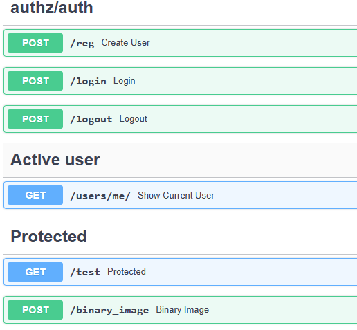

<h1>Binarization</h1>

<a href="https://base64.guru/converter/decode/image">decode base64

</img>
  
<h2>TODO:</h2>
<ol>
  <li>input/output: base64+image</li>
  <li>add front</li>
   <li>add redis</li>
  <li>add celery</li>
  <li>add websocket</li>
  <li>deploy to server. nginx</li>
</ol>

<h2>TODO SERVER:</h2>
<ol>
  <li>only containers</li>
  <li>only ssh</li>
   <li>password -> ssh connection</li>
</ol>

